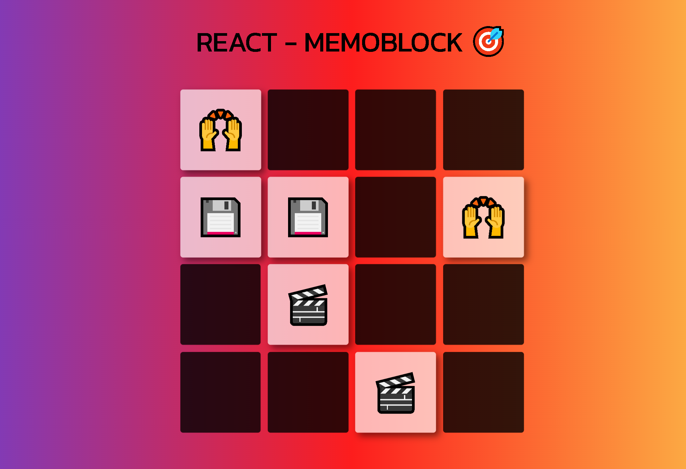

# React - Fundamentos

## Tecnologías Utilizadas:

- React (useState, useEffect)
- ViteJs
- Git

---
## Descripción 📘 

Proyecto en el cual se repasan conceptos tales como el uso de hooks en react (useState, useEffect), la utilización de métodos de javascript tales como splice o math, y profundizar la modularidad de los componentes, de que manera pueden recibir parámetros y envíar argumentos. 
Dichas variables o funciones que compartimos entre componentes, pueden afectar o variar de manera dinámica el estado inicial de un componente, de esta manera los componentes que son afectados en su estado inicial, son modificados por medio del hook useEffect, y a su vez de manera visual, podemos condicionar de que manera se verán con css.

---
## Vista Principal 🎨
---

